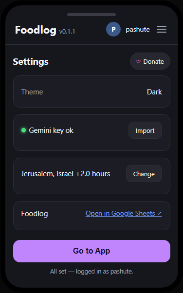
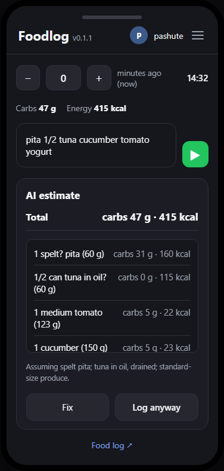

# Foodlog

### File: README.md — Version 0.2.1

Log your meals easily

Foodlog is a free open-source ad-free lightweight, privacy-focused food logging web and phone application.

## Screenshots

  
  

## Donate

If you like it, you may voluntarily donate to support development. 

Todo: Donate button goes here and link

## Safe private information

The app stores information in your own Foodlog Google-sheet, which only you have access to, when you login. 

For the conversation with the AI, estimating how many carbs and what foods you use, it uses your own Gemini API key (which is free to obtain), and processes your information exclusively through the Gemini Flash Lite model, meaning Google Gemini's standard privacy policies apply.

If you have any questions, problems, or feature requests, please reach out to the developer, Pashute, by opening an issue on [GitHub Issues](https://github.com/pashute/Foodlog/issues).

---

## How to Use It

Download and install the app on the desktop or on your phone. (It is built with expo and react native)

Login with your google account.  

Setup your Gemini account to assist you with logging the meals. 

And start talking

### Settings
Access the settings view by clicking the settings hamburger icon on the top right corner. Here you can configure:

* **Gemini API Key:** Enter your personal Gemini API key to power the parsing of your food entries.

* **Google Sheet:** See your Foodlog sheet
  
* **Donations:** Use the Github Support button in the settings panel if you would like to make a voluntary contribution ([link-to-be-given-here]).
